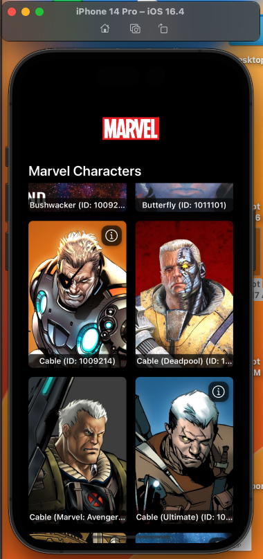
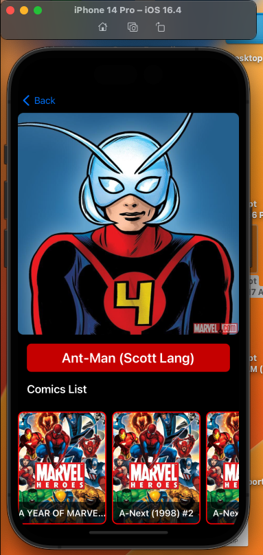
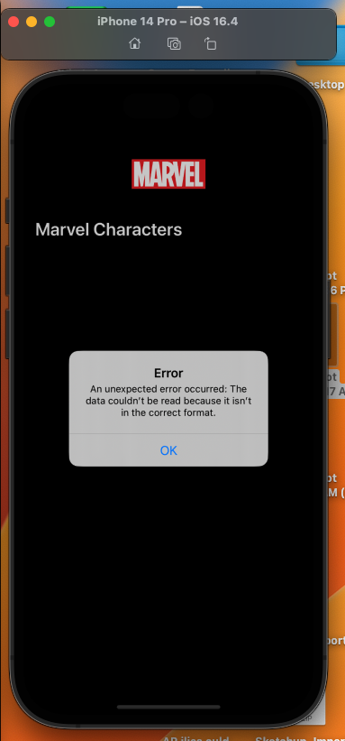

# Marvel Characters (Phazero Challenge)

iOS app using UIKIT that fetches and displays Marvel characters using the Marvel API. This app supports pagination, error handling, and securely manages API keys following best practice and clean MVVM architecture concept.

## Screenshots

Below are screenshots of the app in action:

|         Character Listing         |      Character comics detail      |          Error handeling          |
| :-------------------------------: | :-------------------------------: | :-------------------------------: |
|  |  |  |

## Features

- **Fetch Marvel Characters**: Display a list of Marvel characters.
- **Pagination Support**: Load characters in pages to manage large datasets.
- **Error Handling**: Graceful handling of network and API errors.
- **Display Character details**: Display Details of Marvel characters.
- **Display Comics of Character**: Display Horizontal list of Comics of selected Marvel characters.
- **Redirection to external info link**: Open Browser with selected character external information like wikiLink.

## Installation

### Prerequisites

- **Xcode**: 12 or later
- **Swift**: 5.5 or later
- **iOS**: 14.0 or later

### Setup

1. **Clone the Repository:**

   ```bash
   git clone https://github.com/ilies-space/MarvelCharactersPhazero

   cd MarvelCharactersPhazero
   ```

2. **Open the Project:**

   Open `MarvelCharactersPhazero.xcodeproj` in Xcode.

3. **Add API Keys to Your Project:**

   - **Using `Config.xcconfig` File:**
     Add the following entries to the file, replacing the placeholders with your actual API keys:

   ```plaintext
         MARVEL_PUBLIC_KEY = YOUR_PUBLIC_KEY_HERE
         MARVEL_PRIVATE_KEY = YOUR_PRIVATE_KEY_HERE
   ```

   - Make sure this file is included in your project and properly configured in Xcode's scheme settings.

---

## Code Structure

- **MarvelAPIService.swift**: Handles API requests and authentication.
- **CharacterListViewModel.swift**: Manages character data and pagination.
- **CharacterListViewController.swift**: Displays characters in a collection view.
- **Data Models**: Includes `Character`, `Comics` and `MarvelDataWrapper`.
- **MarvelCharactersPhazeroTests**: Include Unit testing using `XCTest`.

---

### Author

- **Ilies Ould Menouer**
